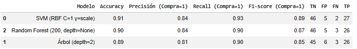
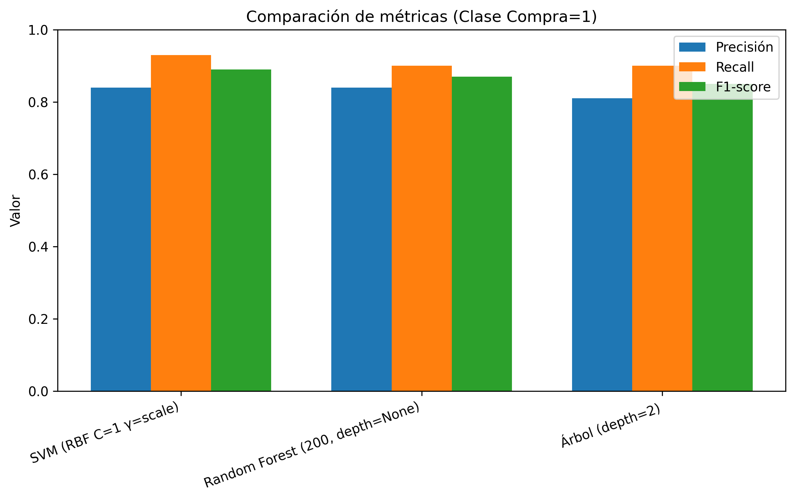
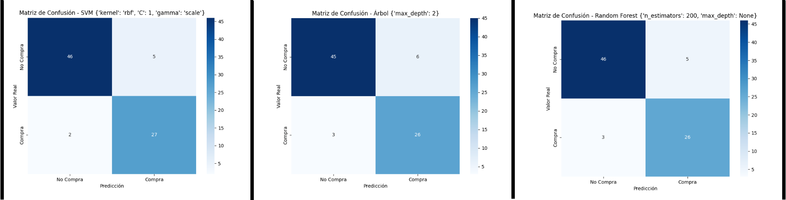

# 📘 Deber: Comparación de Modelos Supervisados

## 📌 Descripción del Proyecto

Este proyecto tiene como objetivo desarrollar, entrenar y comparar tres modelos de aprendizaje supervisado (SVM, Árbol de Decisión y Random Forest) para predecir si un cliente realizará una compra, utilizando variables demográficas y económicas como edad y salario estimado.

El problema abordado corresponde a un problema de clasificación supervisada, donde la variable objetivo toma valores binarios (0 = No compra, 1 = Compra).

---

## 📂 Dataset

Se utilizó el conjunto de datos **Social_Network_Ads.csv**, el cual contiene información sobre usuarios de redes sociales y su comportamiento de compra.

### Variables principales:

- Age: Edad del usuario  
- EstimatedSalary: Salario estimado  
- Purchased: Variable objetivo (0 = No compra, 1 = Compra)

El dataset se encuentra disponible en la carpeta `notebooks/`.

---

## 🧪 Metodología

El desarrollo del proyecto siguió una metodología estructurada basada en el proceso estándar de Machine Learning:

### 1️⃣ Carga y Exploración de Datos (EDA)

- Importación del dataset.
- Revisión de dimensiones, tipos de datos y valores nulos.
- Análisis estadístico descriptivo.
- Evaluación de la distribución de la variable objetivo.
- Visualización de relaciones entre variables.

### 2️⃣ Preprocesamiento

- Codificación de variables categóricas.
- Separación de variables predictoras (X) y variable objetivo (y).
- División del dataset en conjunto de entrenamiento y prueba.
- Estandarización de variables cuando fue necesario (especialmente para SVM).

### 3️⃣ Entrenamiento de Modelos

Se implementaron tres modelos supervisados:

#### 🔹 Support Vector Machine (SVM)
- Kernel lineal como modelo base.
- Kernel RBF para capturar relaciones no lineales.
- Ajuste de hiperparámetros C y gamma.

#### 🔹 Árbol de Decisión
- Evaluación de diferentes profundidades máximas (max_depth = 2, 4 y 6).
- Control del sobreajuste mediante poda.
- Análisis de importancia de variables.

#### 🔹 Random Forest
- Implementación con diferentes números de árboles.
- Ajuste de profundidad máxima.
- Evaluación de estabilidad y robustez.

### 4️⃣ Evaluación de Modelos

Cada modelo fue evaluado utilizando:

- Matriz de confusión
- Precisión
- Recall
- F1-score
- Accuracy

Se priorizó el análisis de la clase positiva (Compra = 1), por su relevancia en el contexto del problema.

### 5️⃣ Comparación Experimental

Se realiza la comparación de los tres modelos a través de tabla resumen, gráfico y matriz de confusión para contrastar el desempeño de los modelos, permitiendo identificar el clasificador con mejores resultados globales.

---

## 📊 Resultados

### 📋 Tabla comparativa de métricas

A continuación, se presenta una tabla resumen con las métricas obtenidas por cada modelo en la clase positiva (Compra = 1), incluyendo accuracy, precisión, recall y F1-score.

#### Interpretación de la tabla comparativa

La tabla evidencia que el modelo SVM con kernel RBF presenta el mejor desempeño global, al alcanzar el mayor accuracy (0.91) y F1-score (0.89). El modelo Random Forest muestra un rendimiento competitivo, mientras que el Árbol de Decisión obtiene valores ligeramente inferiores.

---

### 📈 Comparación gráfica de métricas (Clase Compra = 1)

El siguiente gráfico muestra de manera visual la comparación entre precisión, recall y F1-score para los tres modelos evaluados.

#### Interpretación del gráfico comparativo

El gráfico confirma que el modelo SVM mantiene los valores más altos en recall y F1-score, lo que indica una mayor capacidad para identificar correctamente a los clientes con intención de compra. El Random Forest presenta resultados cercanos, mientras que el Árbol de Decisión muestra un desempeño ligeramente inferior.

---

### 🔲 Matrices de confusión de los modelos

A continuación, se presentan las matrices de confusión correspondientes a cada modelo evaluado.

#### Interpretación de las matrices de confusión

Las matrices de confusión muestran que el modelo SVM presenta el menor número de falsos negativos, lo cual resulta relevante en el contexto del problema, ya que reduce la pérdida de potenciales compradores. Asimismo, el Random Forest mantiene un comportamiento estable, mientras que el Árbol de Decisión presenta una mayor tasa de errores.

Estos resultados respaldan la selección del modelo SVM como el clasificador más adecuado para este problema.

---

### 🏆 Selección del modelo final

Con base en los resultados obtenidos en la tabla comparativa, el análisis gráfico y las matrices de confusión, se selecciona el modelo SVM con kernel RBF (C = 1, gamma = scale) como el modelo final, debido a su mejor equilibrio entre precisión, sensibilidad y robustez predictiva.

---

## 🧠 Conclusiones

Los resultados experimentales muestran que el modelo SVM con kernel RBF (C=1, gamma=scale) obtuvo el mejor desempeño global, alcanzando los valores más altos de F1-score y recall para la clase “Compra”.

El modelo Random Forest presentó un rendimiento estable y competitivo, mientras que el Árbol de Decisión, aunque más interpretable, mostró menor capacidad de generalización en configuraciones profundas.

En consecuencia, se selecciona el modelo SVM como el más adecuado para este problema, al ofrecer el mejor equilibrio entre precisión, sensibilidad y robustez predictiva.

---

## ⚠️ Limitaciones y Trabajo Futuro

- El tamaño del dataset es limitado.
- No se exploraron técnicas avanzadas de optimización automática.
- No se evaluó validación cruzada.

Como trabajo futuro, se recomienda:
- Incorporar más variables.
- Aumentar el tamaño del conjunto de datos.
- Implementar GridSearch o RandomSearch.
- Probar modelos basados en redes neuronales.

---

## 👨‍💻 Autor

**Julio Encalada Cuenca**  
Maestría en Inteligencia Artificial  

